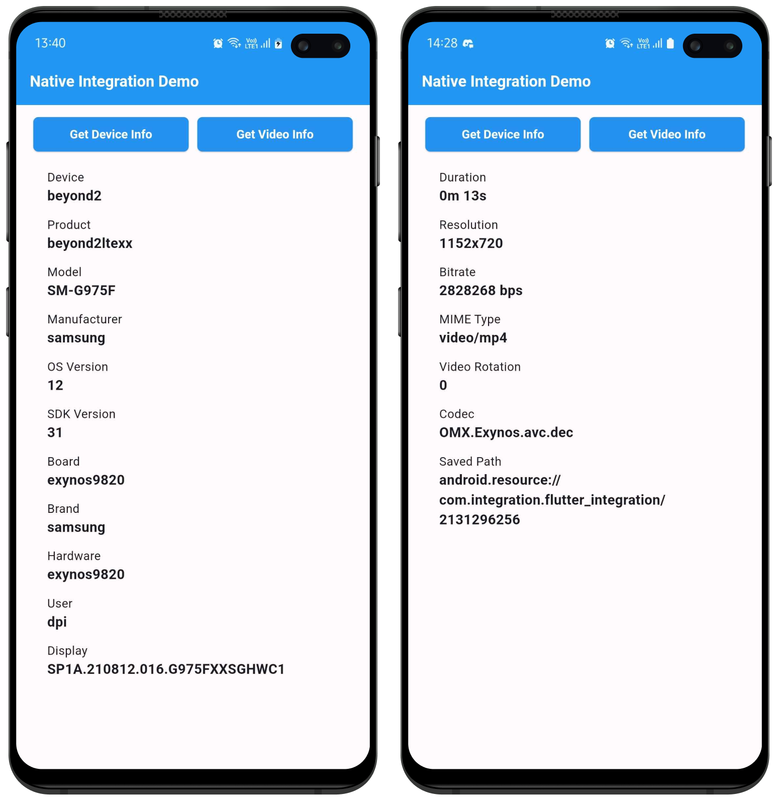

# Native Integration Demo

## Overview

This Flutter application demonstrates the integration of Flutter with native Android code (Kotlin). The app consists of two buttons: "Get Device Info" and "Get Video Info." When the buttons are pressed, the app retrieves device and video information from native code using MethodChannels.

## Implementation Details

### Flutter
- `main.dart`: Main entry point of the Flutter app.
- `info_screen.dart`: Main UI screen that includes two buttons and a text area to display information.
- `info_button.dart`: Custom widget for the buttons.
- `info_list.dart`: Custom widget to display the information in a structured manner.
- `styles.dart`: Defines the styles used in the app.

### Native Android (Kotlin)
- `MainActivity.kt`: Contains methods to retrieve device and video information.
    - `getDeviceInfo()`: Uses the `Build` class to get device information.
    - `getVideoInfo()`: Uses `MediaMetadataRetriever`, `MediaExtractor`, and `MediaCodecList` to get video information, including the codec.

## Output
